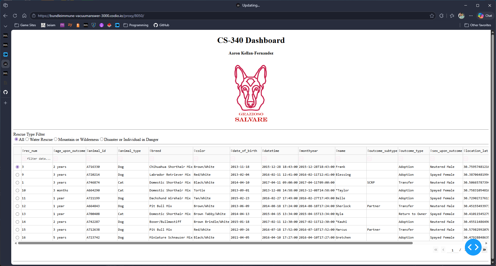
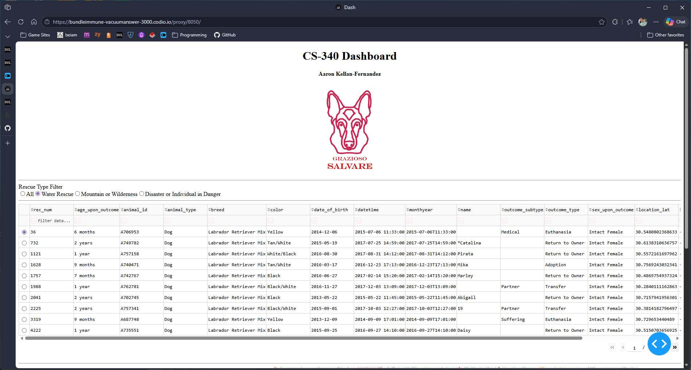
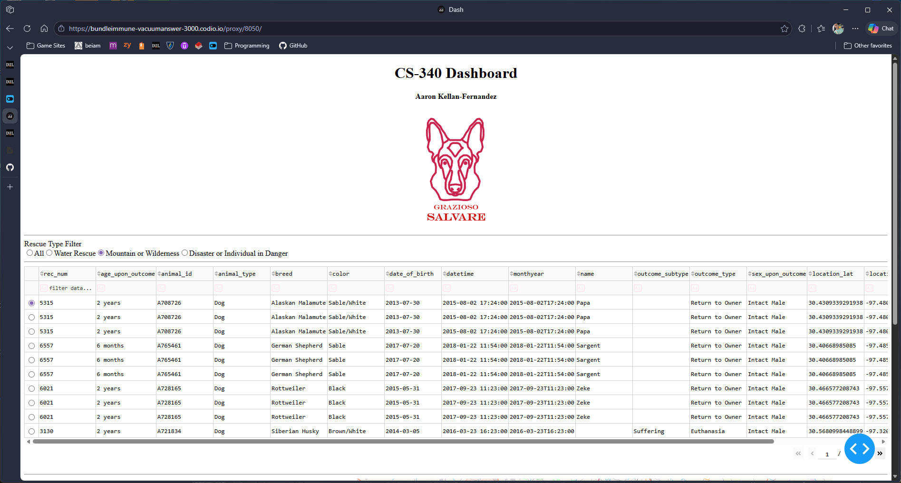
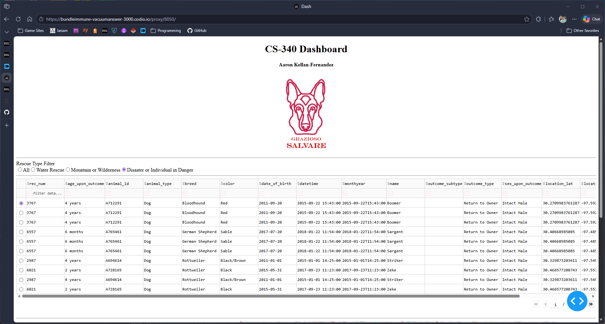

\# CS 340 Project Two – Dashboard Application

\*\*Name:\*\* Aaron Kellan-Fernandez  

\*\*Course:\*\* CS 340 – Client/Server Development  

\*\*Project:\*\* Grazioso Salvare Dashboard  

\---

\## 📌 Project Overview

This project is a client-server dashboard application developed for Grazioso Salvare, an organization that identifies and trains rescue dogs. The application provides an intuitive interface for filtering, viewing, and analyzing animal shelter data stored in a MongoDB database.

The dashboard enables users to quickly identify dogs that meet specific criteria for different rescue types, improving efficiency and reducing training time.

\---

\## ⚙️ Features

\- Interactive filtering options:

&#x20; - All (unfiltered data)

&#x20; - Water Rescue  

&#x20; - Mountain or Wilderness Rescue  

&#x20; - Disaster or Individual Tracking  

\- Dynamic data table:

&#x20; - Displays animal shelter records  

&#x20; - Updates based on selected filters  

&#x20; - Supports sorting and pagination  

\- Data visualizations:

&#x20; - Geolocation map of animal locations  

&#x20; - Pie chart showing breed distribution  

\- User interface:

&#x20; - Grazioso Salvare branding (logo)  

&#x20; - Unique identifier (student name)  

\---

\## 🖥️ Dashboard Demonstration

\### Initial Dashboard (All Data)

\### Water Rescue Filter Applied

\### Mountain or Wilderness Rescue Filter Applied

\### Disaster or Individual Tracking Filter Applied

\---

\## 🧰 Technologies Used

\### MongoDB

\- NoSQL database storing animal shelter data in JSON-like format  

\- Enables flexible schema and efficient querying  

\- Serves as the \*\*model\*\* component  

\### Python (PyMongo)

\- Handles database connection and CRUD operations  

\- Acts as the data access layer  

\### Dash Framework

\- Builds the interactive web dashboard  

\- Provides reactive UI components  

\- Serves as the \*\*view and controller\*\*  

\---

\## 🪜 How It Works

1\. The dataset is stored in MongoDB  

2\. A Python CRUD module retrieves filtered data  

3\. Dash callbacks update:

&#x20;  - Data table  

&#x20;  - Charts  

&#x20;  - Map  

4\. The dashboard dynamically responds to user input  

\---

\## 🚀 How to Run the Project

1\. Ensure MongoDB is running locally  

2\. Import the dataset into the `aac` database  

3\. Verify authentication credentials  

4\. Open `ProjectTwoDashboard.ipynb`  

5\. Run all cells  

6\. Launch the dashboard via JupyterDash  

\---

\## ⚔️ Challenges and Solutions

\*\*Challenge:\*\* Connecting filters to database queries  

\- \*\*Solution:\*\* Used Dash callbacks to dynamically pass filter values into MongoDB queries  

\*\*Challenge:\*\* Synchronizing table and visualizations  

\- \*\*Solution:\*\* Used a shared filtered dataset across all components  

\*\*Challenge:\*\* Dashboard layout and usability  

\- \*\*Solution:\*\* Organized layout into clear sections and added branding for clarity  

\---

\## 🎯 Conclusion

This project demonstrates the integration of MongoDB with a Python-based dashboard using Dash. The final application provides an interactive and user-friendly interface for filtering and visualizing data, aligning with real-world client-server development practices.

\---

\## 📎 Author

\*\*Aaron Kellan-Fernandez\*\*

